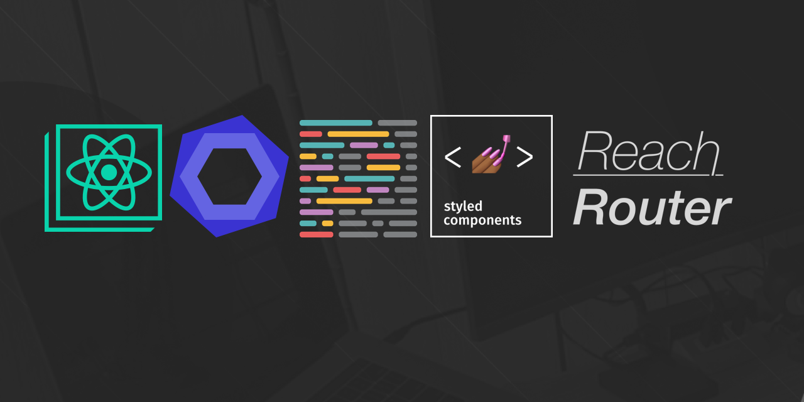

[![Contributors][contributors-shield]][contributors-url]
[![Forks][forks-shield]][forks-url]
[![Stargazers][stars-shield]][stars-url]
[![Issues][issues-shield]][issues-url]
[![MIT License][license-shield]][license-url]

<!-- PROJECT LOGO -->
<br />
<p align="center">
  <a href="https://github.com/carlosazaustre/react-app-scaffolding/">
    
  </a>

  <h3 align="center">React App Scaffolding</h3>

  <p align="center">
    This project was bootstrapped with [Create React App](https://github.com/facebook/create-react-app) and added ESLint + Prettier + Styled Components + Reach Router.
    <br />
    <a href="https://github.com/carlosazaustre/react-app-scaffolding"><strong>Explore the docs »</strong></a>
    <br />
    <br />
    <a href="https://github.com/carlosazaustre/react-app-scaffolding">View Demo</a>
    ·
    <a href="https://github.com/carlosazaustre/react-app-scaffolding/issues">react-app-scaffoldingrt Bug</a>
    ·
    <a href="https://github.com/carlosazaustre/react-app-scaffolding/issues">Request Feature</a>
  </p>
</p>

<!-- TABLE OF CONTENTS -->

## Table of Contents

- [About the Project](#about-the-project)
  - [Built With](#built-with)
- [Getting Started](#getting-started)
  - [Prerequisites](#prerequisites)
  - [Installation](#installation)
- [Usage](#usage)
- [Roadmap](#roadmap)
- [Contributing](#contributing)
- [License](#license)
- [Contact](#contact)
- [Acknowledgements](#acknowledgements)

<!-- ABOUT THE PROJECT -->

## About The Project

[![Product Name Screen Shot][product-screenshot]](https://example.com)

### Built With

- [React.js](https://reactjs.org)
- [Create React App](https://create-react-app.dev/)
- [ESLint](https://eslint.org/)
- [prettier](https://prettier.io/)
- [Husky](https://github.com/typicode/husky)
- [Styled Components](https://styled-components.com/)
- [Reach Router](https://reach.tech/router/)

<!-- GETTING STARTED -->

## Getting Started

To get a local copy up and running follow these simple steps.

### Prerequisites

This is an example of how to list things you need to use the software and how to install them.

- npm

```sh
npm install npm@latest -g
```

### Installation

1. Clone the react-app-scaffolding

```sh
git clone https://github.com/carlosazaustre/react-app-scaffolding.git
```

2. Install NPM packages

```sh
npm install
```

<!-- USAGE EXAMPLES -->

## Available Scripts

In the project directory, you can run:

### `npm start`

Runs the app in the development mode.<br />
Open [http://localhost:3000](http://localhost:3000) to view it in the browser.

The page will reload if you make edits.<br />
You will also see any lint errors in the console.

### `npm test`

Launches the test runner in the interactive watch mode.<br />
See the section about [running tests](https://facebook.github.io/create-react-app/docs/running-tests) for more information.

### `npm run build`

Builds the app for production to the `build` folder.<br />
It correctly bundles React in production mode and optimizes the build for the best performance.

The build is minified and the filenames include the hashes.<br />
Your app is ready to be deployed!

See the section about [deployment](https://facebook.github.io/create-react-app/docs/deployment) for more information.

### `npm run eject`

**Note: this is a one-way operation. Once you `eject`, you can’t go back!**

If you aren’t satisfied with the build tool and configuration choices, you can `eject` at any time. This command will remove the single build dependency from your project.

Instead, it will copy all the configuration files and the transitive dependencies (webpack, Babel, ESLint, etc) right into your project so you have full control over them. All of the commands except `eject` will still work, but they will point to the copied scripts so you can tweak them. At this point you’re on your own.

You don’t have to ever use `eject`. The curated feature set is suitable for small and middle deployments, and you shouldn’t feel obligated to use this feature. However we understand that this tool wouldn’t be useful if you couldn’t customize it when you are ready for it.

## Learn More

You can learn more in the [Create React App documentation](https://facebook.github.io/create-react-app/docs/getting-started).

To learn React, check out the [React documentation](https://reactjs.org/).

### Code Splitting

This section has moved here: https://facebook.github.io/create-react-app/docs/code-splitting

### Analyzing the Bundle Size

This section has moved here: https://facebook.github.io/create-react-app/docs/analyzing-the-bundle-size

### Making a Progressive Web App

This section has moved here: https://facebook.github.io/create-react-app/docs/making-a-progressive-web-app

### Advanced Configuration

This section has moved here: https://facebook.github.io/create-react-app/docs/advanced-configuration

### Deployment

This section has moved here: https://facebook.github.io/create-react-app/docs/deployment

### `yarn build` fails to minify

This section has moved here: https://facebook.github.io/create-react-app/docs/troubleshooting#npm-run-build-fails-to-minify

<!-- ROADMAP -->

## Roadmap

See the [open issues](https://github.com/carlosazaustre/react-app-scaffolding/issues) for a list of proposed features (and known issues).

<!-- CONTRIBUTING -->

## Contributing

Contributions are what make the open source community such an amazing place to be learn, inspire, and create. Any contributions you make are **greatly appreciated**.

1. Fork the Project
2. Create your Feature Branch (`git checkout -b feature/AmazingFeature`)
3. Commit your Changes (`git commit -m 'Add some AmazingFeature'`)
4. Push to the Branch (`git push origin feature/AmazingFeature`)
5. Open a Pull Request

<!-- LICENSE -->

## License

Distributed under the MIT License. See `LICENSE` for more information.

<!-- CONTACT -->

## Contact

Carlos Azaustre - [@carlosazaustre](https://twitter.com/carlosazaustre) - cazaustre@gmail.com

Project Link: [https://github.com/carlosazaustre/react-app-scaffolding](https://github.com/carlosazaustre/react-app-scaffolding)

<!-- MARKDOWN LINKS & IMAGES -->
<!-- https://www.markdownguide.org/basic-syntax/#reference-style-links -->

[contributors-shield]: https://img.shields.io/github/contributors/carlosazaustre/react-app-scaffolding.svg?style=flat-square
[contributors-url]: https://github.com/carlosazaustre/react-app-scaffolding/graphs/contributors
[forks-shield]: https://img.shields.io/github/forks/carlosazaustre/react-app-scaffolding.svg?style=flat-square
[forks-url]: https://github.com/carlosazaustre/react-app-scaffolding/network/members
[stars-shield]: https://img.shields.io/github/stars/carlosazaustre/react-app-scaffolding.svg?style=flat-square
[stars-url]: https://github.com/carlosazaustre/react-app-scaffolding/stargazers
[issues-shield]: https://img.shields.io/github/issues/carlosazaustre/react-app-scaffolding.svg?style=flat-square
[issues-url]: https://github.com/carlosazaustre/react-app-scaffolding/issues
[license-shield]: https://img.shields.io/github/license/carlosazaustre/react-app-scaffolding.svg?style=flat-square
[license-url]: https://github.com/carlosazaustre/react-app-scaffolding/blob/master/LICENSE.txt
[linkedin-shield]: https://img.shields.io/badge/-LinkedIn-black.svg?style=flat-square&logo=linkedin&colorB=555
[linkedin-url]: https://linkedin.com/in/carlosazaustre
[product-screenshot]: docs/screenshot.png
